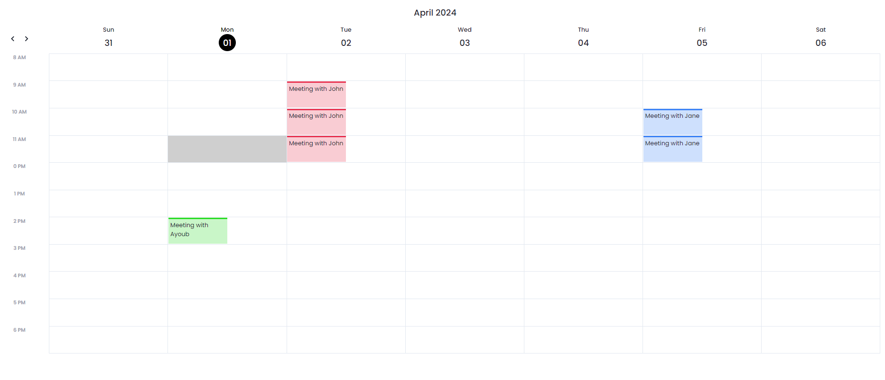
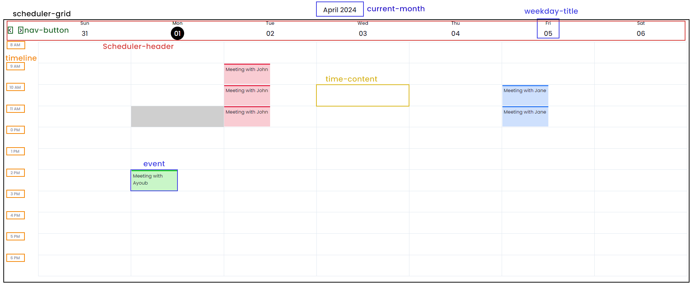
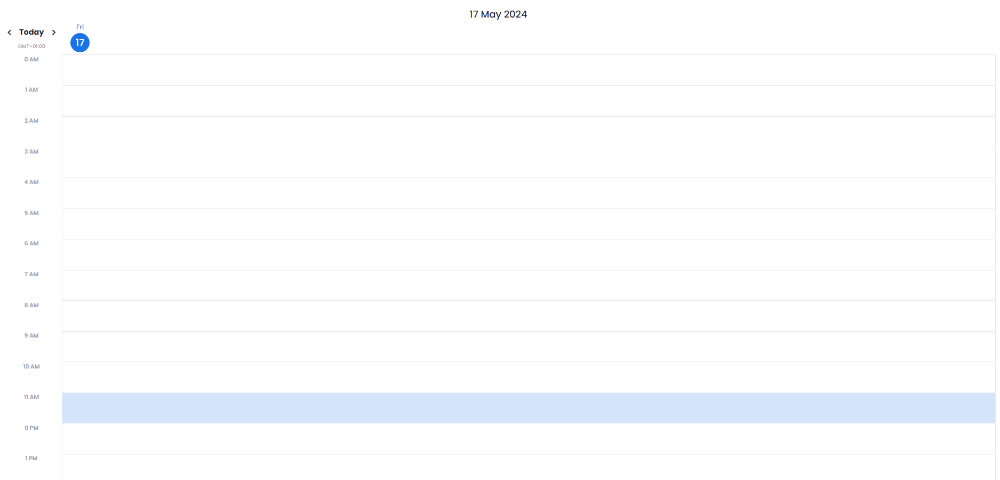

# Overview

**The Calendar Component** is a versatile tool designed to provide an intuitive and interactive calendar interface. It allows users to easily navigate between months or years, and also display data related to every single day.

**The Week-View Component** offers a dynamic week view of your calendar, presenting a user-friendly interface to effortlessly navigate through events scheduled for each day of the week.

**The Day-View Component** provides a vibrant, interactive day view of your calendar, enabling easy navigation through your scheduled events for each day.

# Calendar Component


### Properties :

| Name                 | Type             | Default        | Description                                                      |
| -------------------- | ---------------- | -------------- | ---------------------------------------------------------------- |
| `Language`           | String           | English        | Sets the language of the calendar (English, French or Spanish)   |
| `Week Days`          | String           | All            | If 'Business Days' is selected, only the work days are displayed |
| `Current Day Color`  | String           | #4169E1        | Sets the background color of the current day number              |
| `Selected Day Color` | String           | #4169E1        | Sets the border color of the selected day number                 |
| `Colors`             | Array of Strings | Auto-generated | Sets the background color of the displayed elements              |
| `Year Navigation`    | Boolean          | true           | If false, the year navigation buttons won't be displayed         |
| `Row Height`         | Number           | 150px          | Sets the Height of the calendar rows                             |
| `Border Radius`      | Number           | 6px            | Sets the border redius of the displayed elements                 |

### Data Access Properties :

| Name              | Type             | Required | Description                                                                                                               | Example                                                                                                                                                                                                                               |
| ----------------- | ---------------- | -------- | ------------------------------------------------------------------------------------------------------------------------- | ------------------------------------------------------------------------------------------------------------------------------------------------------------------------------------------------------------------------------------- |
| `Data Source`     | Array of Objects | Yes      | Will contain an array of objects.                                                                                         | [<br />{"name":"Employee 0","type":"Paternité","dateDebut":"2024-03-28","dateFin":"2024-04-03","team":"Team 3"},<br />{"name":"Employee 1","type":"Marriage","dateDebut":"2024-03-13","dateFin":"2024-03-18","team":"Team 2"} <br />] |
| `Selected Date`   | String           | No       | Will contain the variable that will contain the selected Date                                                             | `date`                                                                                                                                                                                                                                |
| `Property`        | String           | Yes      | Will contain the property to be displayed                                                                                 | `name`                                                                                                                                                                                                                                |
| `First Date`      | String           | Yes      | Will contain the start date attribute in our array                                                                        | `dateDebut`                                                                                                                                                                                                                           |
| `Last Date`       | String           | Yes      | Will contain the end date attribute in our array                                                                          | `dateFin`                                                                                                                                                                                                                             |
| `Color Attribute` | String           | No       | Will contain the color attribute in our array (if not set, the colors of the displayed events is auto generated randomly) | `dateFin`                                                                                                                                                                                                                             |
| `Attributes`      | Array of Strings | No       | Sets the additional properties to be displayed                                                                            | [`team`, `type`]                                                                                                                                                                                                                      |

### Events :

- **`On Date Click`** : Trigger an event (open modal, execute a function, standard action, ...) when a day number is clicked.

### Custom CSS :

The Calendar Componant is divided to two main parts, we can access each one through the **"calendar-header"** and **"calendar-grid"** css classes :


Here is a basic example :

```css
/* Make the header disappear */
self .calendar-header {
  display: none;
}

/* Style the navigation buttons */
self .nav-button {
  border: 1px solid blue;
  border-radius: 50%;
  color: blue;
}

/* Style the month title */
self .month-title {
  color: blue;
  font-size: 26px;
}
```


Here is a basic example :

```css
/* When we hover a day container, its color change */
self .day-container:hover {
  background-color: #f0f0f0;
}
```

# Week-View Component



### Properties :

| Name                | Type             | Default        | Description                                                      |
| ------------------- | ---------------- | -------------- | ---------------------------------------------------------------- |
| `Current Day Color` | String           | #1a73e8        | Sets the background color of the current day number              |
| `Hours`             | String           | All            | If 'Work Hours' is selected, only the work hours are displayed   |
| `Week Days`         | String           | All            | If 'Business Days' is selected, only the work days are displayed |
| `Time Format`       | String           | 12 hours       | Sets the time format (13:00 or 1 PM)                             |
| `Colors`            | Array of Strings | Auto-generated | Sets the background color of the displayed elements              |
| `Header Display`    | String           | Auto           | If 'Sticky' is selected, the header position will be sticky      |
| `Element Font Size` | Number           | 12px           | Sets the size of the displayed elements                          |
| `Row Height`        | Number           | 64px           | Sets the height of the scheduler's rows                          |

### Data Access Properties :

| Name          | Type             | Required | Description                                               | Example                                                                                                                                                                                            |
| ------------- | ---------------- | -------- | --------------------------------------------------------- | -------------------------------------------------------------------------------------------------------------------------------------------------------------------------------------------------- |
| `Data Source` | Array of Objects | Yes      | Will contain an array of objects                          | [<br />{"title":"Meeting with John","date":"2024-04-02","startTime":"9:00","endTime":"12:00"},<br />{"title":"Meeting with Jane","date":"2024-04-05","startTime":"10:00","endTime":"12:00"}<br />] |
| `Property`    | String           | Yes      | Will contain the property to be displayed                 | title                                                                                                                                                                                              |
| `Date`        | String           | Yes      | Will contain the date attribute of the events             | date                                                                                                                                                                                               |
| `Start Time`  | String           | Yes      | Will contain the attribute of the start time in our array | startTime                                                                                                                                                                                          |
| `End Time`    | String           | Yes      | Will contain the attribute of the end time in our array   | endTime                                                                                                                                                                                            |

### Custom CSS

The Scheduler Componant is divided to two main parts, we can access each one through the **"scheduler-header"** and **"scheduler-body"** css classes :



Here is a basic example :

```css
/* Make the header disappear */
self .scheduler-header {
  display: none;
}

/* Style the navigation buttons */
self .nav-button {
  border: 1px solid blue;
  border-radius: 50%;
  color: blue;
}

/* Style the month title */
self .month-title {
  color: blue;
  font-size: 26px;
}
```

# Day View Component



### Properties :

| Name                | Type             | Default        | Description                                                    |
| ------------------- | ---------------- | -------------- | -------------------------------------------------------------- |
| `Current Day Color` | String           | #1a73e8        | Sets the background color of the current day number            |
| `Hours`             | String           | All            | If 'Work Hours' is selected, only the work hours are displayed |
| `Time Format`       | String           | 12 hours       | Sets the time format (13:00 or 1 PM)                           |
| `Colors`            | Array of Strings | Auto-generated | Sets the background color of the displayed elements            |
| `Header Display`    | String           | Auto           | If 'Sticky' is selected, the header position will be sticky    |
| `Today Button`      | Boolean          | `true`         | if `false`, the today button will be hidden                    |

### Data Access Properties :

| Name          | Type             | Required | Description                                               | Example                                                                                                                                                                                            |
| ------------- | ---------------- | -------- | --------------------------------------------------------- | -------------------------------------------------------------------------------------------------------------------------------------------------------------------------------------------------- |
| `Data Source` | Array of Objects | Yes      | Will contain an array of objects                          | [<br />{"title":"Meeting with John","date":"2024-04-02","startTime":"9:00","endTime":"12:00"},<br />{"title":"Meeting with Jane","date":"2024-04-05","startTime":"10:00","endTime":"12:00"}<br />] |
| `Property`    | String           | Yes      | Will contain the property to be displayed                 | title                                                                                                                                                                                              |
| `Date`        | String           | Yes      | Will contain the date attribute of the events             | date                                                                                                                                                                                               |
| `Start Time`  | String           | Yes      | Will contain the attribute of the start time in our array | startTime                                                                                                                                                                                          |
| `End Time`    | String           | Yes      | Will contain the attribute of the end time in our array   | endTime                                                                                                                                                                                            |

### Custom CSS

The Scheduler Componant is divided to two main parts, we can access each one through the **"scheduler-header"** and **"scheduler-body"** css classes :


Here is a basic example :

```css
/* Make the header disappear */
self .current-day {
  display: none;
}

/* Style the navigation buttons */
self .nav-button {
  border: 1px solid blue;
  border-radius: 50%;
  color: blue;
}

/* Style the month title */
self .timeline {
  color: blue;
  font-size: 26px;
}
```
