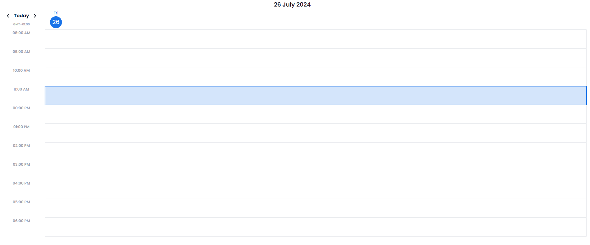

# Overview <a id="top"></a>

[**The Calendar Component**](#calendar) is a versatile tool designed to provide an intuitive and interactive calendar interface. It allows users to easily navigate between months or years, and also display data related to every single day.

[**The Week-View Component**](#weekview) offers a dynamic week view of your calendar, presenting a user-friendly interface to effortlessly navigate through events scheduled for each day of the week.

[**The Day-View Component**](#dayview) provides a vibrant, interactive day view of your calendar, enabling easy navigation through your scheduled events for each day.

### **Tips**💡

In order to be able to visualize data from an **`EntitySelection`** as an **`Array`** in any component of the list, you must declare a function that will run when the webform is loaded ( `onLoad` ), the function creates an array of objects. Here are two example :

```ts
# Example 1

exposed function listEmployees()
	var i : number
	var employees : cs.EmployeeSelection
	employees = ds.Employee.all()
	var newItem : object
	var list : collection
	list = []
	for (i, 0, employees.length-1)
		newItem = {name: "", type: "", startDate: "", endDate: "", team: "", color: ""}
		newItem.name = employees[i].name
		newItem.type = employees[i].leaveType
		newItem.startDate = employees[i].startDate
		newItem.endDate = employees[i].endDate
		newItem.team = employees[i].team.name
		newItem.color = employees[i].team.color
		list.push(newItem)
	end
	return list
```

```ts
# Example 2

exposed function listSessions()
	var i : number
	var sessions : cs.SessionSelection
	sessions = ds.Session.all()
	var newItem : object
	var list : collection
	list = []
	for (i, 0, sessions.length-1)
		newItem = {title: "", date: "", startTime: "", endTime: ""}
		newItem.title = sessions[i].name
		newItem.date = sessions[i].sessionDate
		newItem.startTime = timeString(sessions[i].startTime)
		newItem.endTime = timeString(sessions[i].endTime)
		list.push(newItem)
	end
	return list
```

# Calendar Component <a id="calendar"></a>

[**Back To Top**](#top)


### Properties :

| Name                 | Type             | Default        | Description                                                      |
| -------------------- | ---------------- | -------------- | ---------------------------------------------------------------- |
| `Language`           | String           | English        | Sets the language of the calendar (English, French or Spanish)   |
| `Week Days`          | String           | All            | If 'Business Days' is selected, only the work days are displayed |
| `Current Day Color`  | String           | #4169E1        | Sets the background color of the current day number              |
| `Selected Day Color` | String           | #4169E1        | Sets the border color of the selected day number                 |
| `Year Navigation`    | Boolean          | true           | If false, the year navigation buttons won't be displayed         |
| `Row Height`         | Number           | 150px          | Sets the Height of the calendar rows                             |
| `Border Radius`      | Number           | 6px            | Sets the border redius of the displayed elements                 |
| `Colors`             | Array of Strings | Auto-generated | Sets the background color of the displayed elements              |

### Data Access Properties :

| Name               | Type                          | Required                                            | Description                                                                                               |
| ------------------ | ----------------------------- | --------------------------------------------------- | --------------------------------------------------------------------------------------------------------- |
| `Data Source`      | `Entity Selection` or `Array` | ✅                                                  | Contains the data to be displayed                                                                         |
| `Selected Element` | `Entity` or `Object`          | ❌ <br> (Required in case of using "On Item Click") | Contains the variable that will store the selected element of our data                                    |
| `Selected Date`    | `Date`                        | ❌ <br> (Required in case of using "On Date Click") | Contains the variable that will store the selected Date of the calendar                                   |
| `Property`         | String                        | ✅                                                  | Contains the property to be displayed                                                                     |
| `First Date`       | String                        | ✅                                                  | Contains the start date attribute in our data                                                             |
| `Last Date`        | String                        | ✅                                                  | Contains the end date attribute in our data                                                               |
| `Color Property`   | String                        | ❌                                                  | Contains the color attribute (if not set, the colors of the displayed events are auto-generated randomly) |
| `Attributes`       | Array of Strings              | ❌                                                  | Sets the additional properties to be displayed                                                            |

### Events :

- **`On Date Click`** : Trigger an event (open modal, execute a function, standard action, ...) when a day number is clicked. We can access the currrent displayed date in **Qodly/4D** using : `webEvent.data.selectedDate`.
- **`On Month Change`** : Trigger an event (open modal, execute a function, standard action, ...) when the displayed month change.We can access the currrent displayed date in **Qodly/4D** using : `webEvent.data.currentDate`.
- **`On Item Click`** : Trigger an event (open modal, execute a function, standard action, ...) when an Event or item of the calendar is clicked. We can access the currrent displayed date in **Qodly/4D** using : `webEvent.data.selectedData`.

### Custom CSS :

The Calendar Componant is divided to two main parts, we can access each one through the **"calendar-header"** and **"calendar-grid"** css classes :


Here is a basic example :

```css
/* Make the header disappear */
self .calendar-header {
  display: none;
}

/* Style the navigation buttons */
self .nav-button {
  border: 1px solid blue;
  border-radius: 50%;
  color: blue;
}

/* Style the month title */
self .month-title {
  color: blue;
  font-size: 26px;
}

/* Change the colors of the loading spinner */
self .calendar-outer-spinner {
  border-top-color: red;
}
self .calendar-inner-spinner {
  border-top-color: blue;
}
```


Here is a basic example :

```css
/* When we hover a day container, its color change */
self .day-container:hover {
  background-color: #f0f0f0;
}
```

# Week-View Component <a id="weekview"></a>

[**Back To Top**](#top)


### Properties :

| Name                | Type             | Default        | Description                                                              |
| ------------------- | ---------------- | -------------- | ------------------------------------------------------------------------ |
| `Current Day Color` | String           | #1a73e8        | Sets the background color of the current day number                      |
| `Language`          | String           | English        | Sets the language of the calendar (English, French or Spanish)           |
| `Minutes Interval`  | String           | 60 min         | Sets the interval between the displayed minutes (60 min, 30 min, 15 min) |
| `Hours`             | String           | All            | If 'Work Hours' is selected, only the work hours are displayed           |
| `Week Days`         | String           | All            | If 'Business Days' is selected, only the work days are displayed         |
| `Time Format`       | String           | 12 hours       | Sets the time format (13:00 or 1 PM)                                     |
| `Colors`            | Array of Strings | Auto-generated | Sets the background color of the displayed elements                      |
| `Header Display`    | String           | Auto           | If 'Sticky' is selected, the header position will be sticky              |
| `Row Height`        | Number           | 64px           | Sets the height of the scheduler's rows                                  |
| `Today Button`      | Boolean          | `true`         | if `false`, the today button will be hidden                              |
| `Year Navigation`   | Boolean          | true           | If false, the year navigation buttons won't be displayed                 |

### Data Access Properties :

| Name               | Type                          | Required                                            | Description                                                                                                  |
| ------------------ | ----------------------------- | --------------------------------------------------- | ------------------------------------------------------------------------------------------------------------ |
| `Data Source`      | `Entity Selection` or `Array` | ✅                                                  | Contains the data to be displayed                                                                            |
| `Selected Element` | `Entity` or `Object`          | ❌ <br> (Required in case of using "On Item Click") | Contains the variable that will store the selected element of our data                                       |
| `Selected Date`    | `Date`                        | ❌ <br> (Required in case of using "On Date Click") | Contains the variable that will store the selected Date of the calendar                                      |
| `Property`         | String                        | ✅                                                  | Will contain the property to be displayed                                                                    |
| `Date`             | String                        | ✅                                                  | Will contain the date attribute of the events                                                                |
| `Start Time`       | String                        | ✅                                                  | Will contain the attribute of the start time in our data                                                     |
| `End Time`         | String                        | ✅                                                  | Will contain the attribute of the end time in our data                                                       |
| `Attributes`       | Array of Strings              | ❌                                                  | Sets the additional properties to be displayed                                                               |
| `Color Property`   | String                        | ❌                                                  | Will contain the color attribute (if not set, the colors of the displayed events is auto-generated randomly) |

### Events :

- **`On Item Click`** : Trigger an event (open modal, execute a function, standard action, ...) when an Event or item of the weekview calendar is clicked. We can access the currrent displayed date in **Qodly/4D** using : `webEvent.data.selectedData`.

- **`On Date Click`** : Trigger an event (open modal, execute a function, standard action, ...) when a day number is clicked. We can access the currrent displayed date in **Qodly/4D** using : `webEvent.data.selectedDate`.

- **`On Week Change`** : Trigger an event (open modal, execute a function, standard action, ...) when the displayed week change. We can access the currrent displayed date in **Qodly/4D** using `webEvent.data.currentDate`.

### Custom CSS

The Scheduler Componant is divided to three main parts :

#### scheduler-navigation :


```css
/*Hide the scheduler navigation*/
self .scheduler-navigation {
  display: none;
}
```

#### scheduler-header :


```css
/* Style the days of the week (Display only the first letter of the day) */
self .weekday-day {
  font-size: 0px;
}
self .weekday-day::first-letter {
  font-size: 16px;
}

/* Style the next week navigation button */
self .nav-button .next-week {
  border: 1px solid blue;
  border-radius: 50%;
  color: blue;
}

/* Change the background of the loading spinner */
self .calendar-spinner {
  background-color: black;
}
```

#### scheduler-body :


```css
/* Style the events depending on their room */

self .event:has(span[title='Room 0']) {
  border-color: #cc0000 !important;
  background-color: #cc000050 !important;
}

self .event:has(span[title='Room 1']) {
  border-color: #38761d !important;
  background-color: #38761d50 !important;
}

self .event:has(span[title='Room 2']) {
  border-color: #0b5394 !important;
  background-color: #0b539450 !important;
}
```

# Day View Component <a id="dayview"></a>

[**Back To Top**](#top)



### Properties :

| Name                | Type             | Default        | Description                                                              |
| ------------------- | ---------------- | -------------- | ------------------------------------------------------------------------ |
| `Current Day Color` | String           | #1a73e8        | Sets the background color of the current day number                      |
| `Language`          | String           | English        | Sets the language of the calendar (English, French or Spanish)           |
| `Minutes Interval`  | String           | 60 min         | Sets the interval between the displayed minutes (60 min, 30 min, 15 min) |
| `Hours`             | String           | All            | If 'Work Hours' is selected, only the work hours are displayed           |
| `Time Format`       | String           | 12 hours       | Sets the time format (13:00 or 1 PM)                                     |
| `Colors`            | Array of Strings | Auto-generated | Sets the background color of the displayed elements                      |
| `Header Display`    | String           | Auto           | If 'Sticky' is selected, the header position will be sticky              |
| `Today Button`      | Boolean          | `true`         | if `false`, the today button will be hidden                              |

### Data Access Properties :

| Name               | Type                         | Required                                            | Description                                                                                                  |
| ------------------ | ---------------------------- | --------------------------------------------------- | ------------------------------------------------------------------------------------------------------------ |
| `Data Source`      | `EntitySelection` or `Array` | ✅                                                  | Contains the data to be displayed                                                                            |
| `Selected Element` | `Entity` or `Object`         | ❌ <br> (Required in case of using "On Item Click") | Contains the variable that will store the selected element of our data                                       |
| `Selected Date`    | `Date`                       | ❌ <br> (Required in case of using "On Date Click") | Contains the variable that will store the selected Date                                                      |
| `Property`         | String                       | ✅                                                  | Contains the property to be displayed                                                                        |
| `Date`             | String                       | ✅                                                  | Contains the date attribute in our data                                                                      |
| `Start Time`       | String                       | ✅                                                  | Contains the attribute of the start time in our data                                                         |
| `End Time`         | String                       | ✅                                                  | Contains the attribute of the end time in our data                                                           |
| `Attributes`       | Array of Strings             | ❌                                                  | Sets the additional properties to be displayed                                                               |
| `Color Property`   | String                       | ❌                                                  | Will contain the color attribute (if not set, the colors of the displayed events is auto generated randomly) |

### Events :

- **`On Item Click`** : Trigger an event (open modal, execute a function, standard action, ...) when an Event or item of the weekview calendar is clicked. We can access the currrent displayed date in **Qodly/4D** using : `webEvent.data.selectedData`.

- **`On Date Click`** : Trigger an event (open modal, execute a function, standard action, ...) when a day number is clicked. We can access the currrent displayed date in **Qodly/4D** using : `webEvent.data.selectedDate`.

- **`On Day Change`** : Trigger an event (open modal, execute a function, standard action, ...) when the displayed day change. We can access the currrent displayed date in **Qodly/4D** using `webEvent.data.currentDate`.

### Custom CSS

The DayView Componant is formed of two main parts :

#### dayview-header :


```css
/* Make the header disappear */
self .current-day {
  display: none;
}

/* Style the next day navigation button */
self .nav-button .next-day {
  border: 1px solid blue;
  border-radius: 50%;
  color: blue;
}
```

#### dayview-body :


```css
/* Style the time (timeline)*/
self .timeline {
  color: blue;
  font-size: 26px;
}

/* Style the event title (display only the first line of the title)*/
self .event-title {
  overflow: hidden;
  display: -webkit-box;
  -webkit-box-orient: vertical;
  -webkit-line-clamp: 1;
}
```
